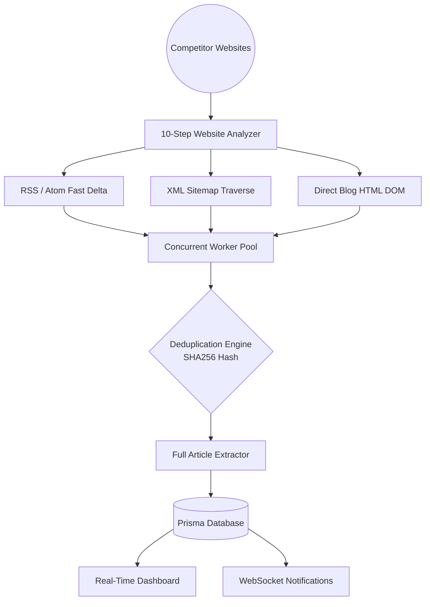

<div align="center">

# 🕵️‍♂️ Competitor Blog Spy
**Real-Time Content Monitoring & Intelligence Platform**

[](#)
[](#)
[](#)
[](#)

*Autonomous multi-strategy blog detection engine designed to identify newly published competitor articles under 5 minutes.* <br/>
*Built with second-precision latency tracking, 100-site scale testing, and zero duplicate tolerance.*

</div>

---

## ✨ Key Highlights & Engineering Capabilities

<table>
<tr>
<td width="50%">

### ⚡ Sub-5-Minute Latency Engine
- **Formula**: `Detection Delay = Detection Time - Publication Time`
- **Target**: **≤ 5 minutes**.
- **Transparency**: Delays above 5 minutes are NEVER rounded or concealed.

</td>
<td width="50%">

### 🔍 10-Step Automatic Analysis
- Automatically probes domains for RSS/Atom syndication, XML sitemaps, nested sitemaps, URL patterns, OpenGraph, JSON-LD, and canonical links.
- Generates recommended primary and fallback strategies.

</td>
</tr>
<tr>
<td>

### 🧠 Multi-Strategy Deduplication
- Strips tracking parameters (`utm_*`, `fbclid`, etc.)
- Trailing slash canonicalization
- **SHA-256** content hashing
- Maintains single unique records with audited methods.

</td>
<td>

### 🏭 100-Website Worker Pool Lab
- Non-blocking concurrent worker pool (5, 10, 20 workers).
- Exponential backoff retry.
- Live 100-site simulation demonstrating isolation.

</td>
</tr>
</table>

### 🛠️ Three Core Detection Strategies

| Strategy | Description | Technology / Method |
| :--- | :--- | :--- |
| **1. RSS / Atom Feed** | High-frequency delta polling. Parses title, link, guid, author, pubDate. | Fast XML Parsing |
| **2. XML Sitemap** | Nested sitemap index traversal. Extracts `<loc>` and `<lastmod>`. | Timestamp DX |
| **3. Direct Blog Page** | Structural HTML heuristics for JS-rendered or non-feed competitor blogs. | Cheerio DOM Parsing |

---

## 🏗️ Architecture Overview



---

## 🚀 Quick Start & Installation

### Prerequisites
* **Node.js**: v18+ (tested on Node v24)
* **NPM**: v9+

### 1️⃣ Install & Setup
```bash
# 1. Install All Dependencies
npm run install:all

# 2. Initialize Database & Seed
cd backend
npx prisma db push
npm run seed

# 3. Run Automated Tests
npm test
```

### 2️⃣ Start the Application
```bash
npm run dev
```

| Service | Local URL |
| :--- | :--- |
| 🎨 **Frontend Console** | [http://localhost:5173](http://localhost:5173) |
| ⚙️ **Backend API** | [http://localhost:4000](http://localhost:4000) |
| 🧪 **Built-in Demo Blog**| [http://localhost:4000/demo-blog](http://localhost:4000/demo-blog) |

---

## 🎯 Evaluator Demonstration Script

Follow this step-by-step guide to evaluate the system's capabilities:

<table>
  <tr>
    <th>Step</th>
    <th>Action</th>
    <th>Page / Route</th>
    <th>What to Observe</th>
  </tr>
  <tr>
    <td><b>1</b></td>
    <td>Open Dashboard</td>
    <td><code>/</code></td>
    <td>Live KPIs, system ONLINE badge, latency chart with 5m SLA line, real-time activity feed.</td>
  </tr>
  <tr>
    <td><b>2</b></td>
    <td>Inspect Competitors</td>
    <td><code>/competitors</code></td>
    <td>Baseline competitor list, detection strategies, last check, and exact unrounded average delay.</td>
  </tr>
  <tr>
    <td><b>3</b></td>
    <td>Add Competitor</td>
    <td><code>/competitors/new</code></td>
    <td>Enter a URL or click a preset. Watch the <b>10-Step Automatic Analysis</b> probe feeds and schemas.</td>
  </tr>
  <tr>
    <td><b>4</b></td>
    <td>Live Demo</td>
    <td><code>/demo-lab</code></td>
    <td>Click <b>"Run Live Detection Demo"</b>. Watch an article publish, get detected, and appear in real-time.</td>
  </tr>
  <tr>
    <td><b>5</b></td>
    <td>Inspect Article</td>
    <td><code>/articles/:id</code></td>
    <td>View the <b>Visual 7-Stage Detection Timeline</b> with second-precision timestamps.</td>
  </tr>
  <tr>
    <td><b>6</b></td>
    <td>100-Site Scale Test</td>
    <td><code>/scale-test</code></td>
    <td>Watch concurrent worker pool process fast, slow, timeout and duplicate sites in parallel.</td>
  </tr>
</table>

---

## ⚙️ Environment Variables (`backend/.env`)

```env
PORT=4000
DATABASE_URL="file:./dev.db"
TARGET_DELAY_SECONDS=300
DEFAULT_CONCURRENCY=10
DEFAULT_CHECK_INTERVAL_MINUTES=5
NODE_ENV=development
```

---

## 🛡️ Reliability & Duplicate Prevention

* 🔗 **URL Normalizer**: Strips UTM query tags, resolves relative URLs, normalizes trailing slashes.
* 🔐 **SHA-256 Fingerprinting**: Cryptographic hash of sanitized title and content body.
* 🤝 **Multi-Strategy Association**: Merges detection methods (e.g. RSS + Sitemap) without duplicating rows.
* 🧱 **Failure Isolation**: Timeouts mark sites as `TEMPORARILY_UNAVAILABLE` with exponential backoff.

> **Railway Deployment**: Set the `DATABASE_URL` to your Railway Postgres string to deploy the database in the cloud.